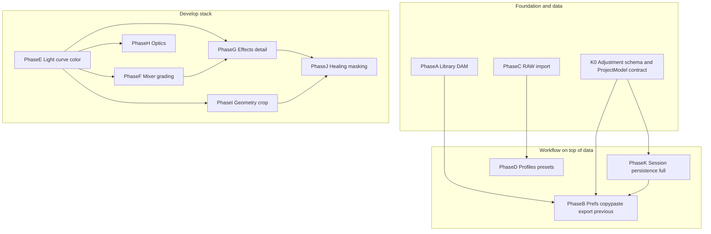

# Incremental delivery, dependencies, and engineering discipline

This document complements [PRODUCT_ROADMAP.md](PRODUCT_ROADMAP.md) Part 1. It answers: how phases depend on each other, how to order work, how to ship **very small** slices with **tests and technical specs first**, how to **decouple** so new work does not destabilize existing behavior, and how to use **logging** for traceability.

---

## Quick start (contributors)

1. **Repository root:** clone and `cd` into `PhotoEdit`.
2. **Install:** `pipenv install --dev` (see root [README.md](../../README.md#-installation); if that anchor fails in your viewer, open the **Installation** section there).
3. **Run the app:** `pipenv run python -m src.main` (see root [README.md](../../README.md#run-the-application)).
4. **Run tests:** `pipenv run pytest`.
5. **Pick the next slice** using section 2 (ordering); write and **approve** a detailed implementation note per **section 4** in [implementation-notes/](implementation-notes/) **before** any implementation.
6. **After a slice is done:** commit with a focused message per [section 4.4](#44-git-commit-after-each-slice).

---

## 1. Phase dependency graph (logical)

Phases are not strictly linear. Below is the **minimum dependency** view (arrows mean “should have or design before”).



**Notes on cycles**

- **B** (copy/paste edit settings, export-with-previous) and **K** (session persistence): both need a **stable, versioned adjustment payload** (dict or JSON schema). Resolve the cycle by introducing **K0** (below): design and implement the **schema + serialization** and wire it read/write in one image **before** full library persistence or full B.
- **D** (profiles): can start after **C** if profiles are meaningful for RAW; if presets are JPEG-only at first, **D can parallel C** after **E** has at least one slider path. Prefer **E first vertical slice** (e.g. Highlights only) before a large **D** UI, unless product priority is presets-first.

---

## 2. Recommended ordering (with parallel options)

| Order | Phase | Rationale |
|------:|-------|-----------|
| 1 | **K0** (not a full phase in the PDF list): technical spec + `AdjustmentState` / project file **schema**, version field, migration hook | Unlocks **B** and **K** without thrashing the pipeline |
| 2a | **A** (library DAM) | Independent of develop; improves iteration on real sets |
| 2b | **C** (RAW) | Independent; can run **in parallel** with A by a second contributor |
| 3 | **K** (session persistence) minimal: save/load one folder + current image + adjustment blob | Validates K0; enables reliable **B** |
| 4 | **B** (prefs, export previous, copy/paste settings) | Depends on K0/K for durable settings |
| 5 | **D** (profiles/presets) | After one stable **E** slice is ideal so presets target real parameters |
| 6 | **E** | Core develop; blocks F, G, H, I |
| 7 | **F**, **G** | After **E**; F and G can be parallelized once **E** processor contract is stable |
| 8 | **H** | Optics: after **E** (or a thin slice of **E**); may share image math utilities with **G** |
| 9 | **I** | Geometry/crop: needs stable viewer coordinates; often after **E** global path is clear |
|10 | **J** | Healing/masking: depends on **I** (crop/viewport) and **G** (local application stack) at minimum |

**Phase L** (merge/cloud/defer) stays out of this chain until product requires it.

---

## 3. Interdependency matrix (compact)

| Phase | Depends on (hard) | Soft / parallel |
|-------|-------------------|-----------------|
| A | -- | C |
| B | K0, K (for persistence) | A (for multi-image paste) |
| C | -- | A |
| D | C if RAW-centric presets | E |
| E | K0 for undo/history payload consistency (recommended) | -- |
| F | E | -- |
| G | E | F |
| H | E | G |
| I | E | H |
| J | E, I | G, F |
| K | K0 | A, B |

---

## 4. Before implementation: detailed implementation plan (mandatory)

**No feature coding starts** until a written plan exists, has been **reviewed**, and is explicitly **accepted** (checkbox in the note or PR approval). A one-line ticket is **not** enough.

Create **one markdown file** per slice under [implementation-notes/](implementation-notes/), named e.g. `YYYY-MM-DD-topic.md`. The document has two layers:

### 4.1 Detailed plan (required depth)

Write for a **future maintainer** and for **yourself under time pressure**. Minimum sections:

1. **Problem and goal** -- user-visible outcome; **non-goals** (what this slice will *not* change).
2. **Current behavior** -- what the code does today (file/function pointers); edge cases already known.
3. **Proposed design** -- components touched (view vs controller vs service); **sequence diagrams or bullet flows** for user actions; data read/written.
4. **API and data contracts** -- new/changed signals, DTO fields, `QSettings` keys, JSON keys, **versioning** if formats change; backward compatibility rule.
5. **Nuances and failure modes** -- e.g. async preview races, empty library, missing file, cancel dialog, Windows vs paths, large images, **order of operations** (when to persist vs when to update model).
6. **UI and reskin impact** -- which widgets/styles change; confirm business logic stays out of views ([section 5.1](#51-view-vs-logic-reskin-and-layout-changes-later)).
7. **Dependencies** -- other slices or phases blocked by this; feature flags if any.
8. **Test plan** -- new unit/integration/pytest-qt cases; **manual smoke checklist** with exact steps.
9. **Rollout and rollback** -- how to disable the change; what to revert if production misbehaves.
10. **Acceptance criteria** -- bullet list that must all be true before merge (objective, testable).

Length guideline: **roughly two to four screens** of prose for a non-trivial slice; small bugfixes can be shorter but still must cover risks + tests + acceptance.

### 4.2 Review gate

- Author (or peer) **reviews** the detailed plan; update the doc until open questions are closed.
- Only then: mark **“Plan approved -- implementation allowed”** (date + name) at the bottom of the file.

### 4.3 Implementation, tests, merge

1. **Implement** strictly scoped to the approved plan; if scope creeps, **update the plan first** and re-approve.
2. **Automated tests** as written in the plan; CI green.
3. **Manual smoke** per plan checklist where UI is involved.
4. **Merge**; link the implementation note in the PR description.

### 4.4 Git commit (after each slice)

When automated tests pass and any manual smoke from the plan is done, **commit** with a message that matches one slice (or one logical commit per slice if several land on the same branch).

- **One slice = one commit** when practical. If a branch contains multiple completed slices (for example logging baseline and pipeline migration), use **separate commits** in dependency order so `git revert` can undo one slice without the other.
- **Subject line:** short imperative summary; prefix with `feat`, `fix`, or `docs` and an optional scope, consistent with recent history (for example `feat(logging): ...`, `feat(pipeline): ...`).
- **Body (optional):** two to six lines covering what changed, why it matters, and test outcome if helpful; reference the implementation note filename under `docs/planning/implementation-notes/`.
- **Do not** commit unrelated drive-by changes in the same commit as a slice.

**Gate:** Do not start the **next** slice until this slice’s tests pass, acceptance criteria are met, the implementation note is complete (including a short **“Implementation summary”** subsection added after merge: what landed vs what was deferred), and the **git commit** for the slice is recorded (local or pushed per team practice).

---

## 5. Decoupling guidelines (avoid “everything breaks”)

- **Stable contracts:** Keep adjustment payloads and file/project formats **versioned**; add fields, do not rename silently.
- **Processor boundary:** New panels talk to **thin controller APIs** and **processors** behind the same `BaseProcessor` / worker queue pattern; avoid new global singletons for feature state.
- **Feature flags (optional):** For risky UI (e.g. new filmstrip), guard with a simple `QSettings` or env flag until stable.
- **Regression tests:** For each bug fix, add one test that would have failed without the fix.
- **Avoid deep imports:** Views should not import processors directly; go through controller/service as in current [ARCHITECTURE.md](../ARCHITECTURE.md).

### 5.1 View vs logic (reskin and layout changes later)

Goal: you can **refresh the GUI** (layout, spacing, themes, widget choice) **without rewriting** exposure/color math, undo, or file I/O.

- **Views are thin:** Widgets emit **signals** with plain data (`dict`, paths, enums); they do not call OpenCV/NumPy or read files except through a **controller or service**.
- **No adjustment math in widgets:** Sliders bind to labels + signals only; `ImageController` / services own validation and debounced preview.
- **Styling is data:** Prefer **Qt stylesheets** or **QSS files** under `resources/` (or equivalent) keyed by a **theme name** stored in app settings -- not hard-coded hex in Python scattered across panels.
- **Design tokens:** Centralize spacing, font roles, and palette names in one module or JSON so a reskin edits one place.
- **Optional UI models:** For complex lists (library), keep **sort/filter state** in a small model the view displays; swapping the view implementation (list vs grid) keeps the same model API.

This matches the MVC + service layout already described in [ARCHITECTURE.md](../ARCHITECTURE.md); the plan is to **enforce** it when adding new panels.

---

## 6. Application and session persistence (professional baseline)

The PDF **Phase B / §3** mentions preferences, but a **professional desktop** app also needs **durable app state** even before full project files (**Phase K**). Today the codebase has **no `QSettings` (or equivalent)** -- last open directory, window layout, and similar values are **not** persisted; treat that as an explicit **gap**.

**Recommended first persistence slice (can precede or overlap K0):**

| Key / concern | Example | Typical store |
|----------------|---------|----------------|
| Last **open/import** directory | `QFileDialog` default dir | `QSettings` + `SettingsService` |
| Last **export** directory and last export options | Export with previous | `QSettings` / small JSON |
| **Window geometry** and dock/toolbar visibility | Restore session | `QSettings` or `QMainWindow.saveState()` |
| **Recent files** (bounded list) | Open recent | `QSettings` or JSON under app data dir |
| **Theme / interface** choices | Dark vs high contrast | `QSettings` |

**Separation from Phase K:** **K** is **document-centric** (library + per-image edits in a project file). **App settings** are **user-centric** (always apply, no project open). Implement a small **`SettingsService`** (or `settings_model` per architecture doc) that wraps `QSettings` with typed getters/setters and unit tests -- **not** scattered `QSettings` calls inside views.

**Plan update:** Track this explicitly under **Phase B** (and README “first steps”) as **B-app** or the first bullet of **B** before copy/paste settings, so “last path” is fixed early without coupling to K0 JSON.

### 6.1 Professional desktop shell (plan items; spans Phase B, export, and K)

These are **not** spelled out in the Lightroom PDF checklist but belong in the product plan. Each needs its own **detailed implementation plan** ([section 4](#4-before-implementation-detailed-implementation-plan-mandatory)) before coding.

| Topic | Intent | Typical phase |
|--------|--------|----------------|
| **Crash-safe / draft autosave** | Periodic or on-adjustment snapshot of edits + recovery prompt on startup; avoid corrupting the user’s only original | **K** (+ small B for “recovery enabled” pref) |
| **Export overwrite confirmation** | Clear prompt when export path exists; optional “always overwrite” with danger flag in settings | **B** / export dialog |
| **Single-instance (optional)** | Optional lockfile or Qt single application so double-click does not spawn two editors fighting one catalog | **B** or shell |
| **Update channel (optional)** | Check for newer releases / show release notes; no auto-install without consent | Post-MVP or **L** |
| **Telemetry / analytics (opt-in)** | Default off; explicit consent; minimal payload; document what is sent | **B** prefs + policy doc |

Order these after **app settings (section 6)** and **K0** where they touch project JSON or autosave format.

---

## 7. Logging and traceability

- Use Python **`logging`** with a named logger per module (`logging.getLogger(__name__)`).
- **Levels:** `DEBUG` for per-adjustment preview and queue timing; `INFO` for load/save/export and session path; `WARNING`/`ERROR` for failures with **exception `exc_info=True`** where applicable.
- **Correlation:** When async preview runs, log a **monotonic request id** (already present in spirit as `_latest_request_id` in controller) and pass it through worker logs so stdout traces align with UI behavior.
- **User-facing errors:** Continue `QMessageBox` for fatal paths; log the same message at `ERROR` with stack trace.
- **Do not** log full file paths in production builds if privacy matters; for dev, full paths are fine.

---

## 8. Where this ties to the roadmap

- Part 1 phases in [PRODUCT_ROADMAP.md](PRODUCT_ROADMAP.md) stay the **what**; this file is the **how** (order, gates, docs, tests, logs).
- Part 2 checklists: mark items done only when the **slice + tests + approved implementation note (section 4) + post-merge implementation summary** for that item exist.
- **Persistence, reskin, professional shell:** Sections **5.1**, **6**, **6.1**, and the **mandatory detailed plan (section 4)** apply to every slice; implementation notes must reference them when relevant.

---

## 9. Folder convention

```
docs/planning/
  PRODUCT_ROADMAP.md          # What and which phase
  INCREMENTAL_WORKFLOW.md     # This file (how)
  implementation-notes/       # One note per small slice (create when first slice lands)
    README.md                 # Index template optional
```

Create `implementation-notes/` when you land the first K0 or first post-roadmap slice.
