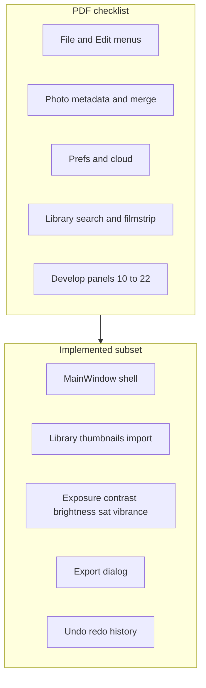

# PhotoEdit — Product roadmap and feature catalog

This document merges the former **LIGHTROOM_IMPLEMENTATION_PHASES.md**, **FEATURES_PLAN.md**, and the phased timeline from **PROJECT_ROADMAP.md**. Source checklist PDF (repo root): [Lightroom_Feature_List.pdf](../Lightroom_Feature_List.pdf).

## Contents

0. [Incremental workflow, dependencies, quality gates, and mandatory pre-implementation plans](INCREMENTAL_WORKFLOW.md) (how to ship small slices; professional shell in section 6.1 of that doc)
1. [Lightroom parity and phased implementation](#part-1-lightroom-parity-and-phased-implementation)
2. [Feature planning catalog](#part-2-feature-planning-catalog)
3. [Delivery timeline and milestones](#part-3-delivery-timeline-and-milestones)

---

## Part 1: Lightroom parity and phased implementation
## Analysis of [Lightroom_Feature_List.pdf](Lightroom_Feature_List.pdf)

**What this file is:** A **structured text inventory** (6 pages) titled *Lightroom Clone Feature List*. It states that features were *extracted from the provided Lightroom features PDF* (screenshots) and grouped for implementation. It is **not** Adobe's official spec -- it is your **derivative checklist** with explicit honesty about unreadable UI chrome.

**Extractability:** Unlike image-only PDFs, this document reads cleanly end-to-end (numbered sections 1-24, bullets, and sixteen "overall feature groups" on pages 5-6).

**Structure:**

| Pages | Content |
|-------|---------|
| 1 | Sections 1-3: File menu, Edit menu, Account/Preferences |
| 2 | Sections 4-9: Photo menu through main workspace outline |
| 3 | Sections 10-15 (start): Profiles through Color Grading / Blending |
| 4 | Sections 15-20 (rest): Balance slider through Crop tool |
| 5 | Sections 21-24 + overall groups 1-16 |
| 6 | Caveat note only |

**Explicit gaps called out in the document itself (do not over-spec):**

- **Section 5 View** and **Section 6 Help**: items exist in sources but text too small to transcribe.
- **Section 7 Export panel**: sidebar present; **exact control labels** not fully readable.
- **Section 22 Masking**: AI/object/sky-style options **inferred**, labels not fully readable.
- **Section 23 Settings / three-dot menu**: actions described qualitatively only.

**Relationship to [Lightroom features.pdf](Lightroom%20features.pdf) in the repo:** Keep **Lightroom_Feature_List.pdf** as the **planning source of truth** for bullets; treat the older file as the original visual reference if you need to verify labels later.

**Coverage sanity check:** Sections **11-22** map cleanly onto a classic **Develop-module** ordering (Basic -> Curve -> Color -> Mixer -> Grading -> Effects -> Detail -> Optics -> Geometry -> Crop -> Heal -> Mask). Sections **1-4, 8-10, 24** map to **Library/DAM + metadata + merge**. Sections 5-7 are **shell/navigation/export UI**. Section 3 is **cloud/account** (often defer for a desktop clone).

---

## Source inventory (sections 1-24 from Lightroom_Feature_List.pdf)

The following matches **sections 1-24** in [Lightroom_Feature_List.pdf](Lightroom_Feature_List.pdf).

| # | PDF area | Topics |
|---|----------|--------|
| 1 | File menu | Add Photos, Search My Photos, Import Profiles & Presets, Export, Export with Previous, Edit in Photoshop, Migrate From (Lr Classic / Elements), Exit |
| 2 | Edit menu | Undo/Redo, clipboard, selection, Next/Previous Photo, Albums (create folder/album, delete, rename, leave, abuse report, target album, add photo, share), Stacks, Duplicate/Delete/Remove photo, Preferences |
| 3 | Account / Preferences | Account, Local Storage, General, Import, Interface, Performance, Cloud usage, Manage Account, Plans |
| 4 | Photo menu | Rating (0-5), Flag (pick/reject, levels), Add to Album, Keyword, Edit Date & Time, Rotate/Flip, Auto Settings, Legacy settings, Copy/Paste Edit Settings, Version, Reset, Enhance, Photo Merge (HDR / Panorama / HDR Panorama) |
| 5 | View menu | Display/navigation (labels not fully readable in source screenshots) |
| 6 | Help menu | (labels not fully readable in source screenshots) |
| 7 | Export panel | Export UI; right-side export settings sidebar (exact labels partially unreadable in source) |
| 8 | Search panel | Search box + results/suggestions panel on the right |
| 9 | Main editing workspace | Right edit panel, canvas, bottom filmstrip, tool icons, collapsible adjustment sections |
| 10 | Profiles / Presets | Profile selector; Adobe Color/Landscape/Portrait/Standard/Vivid/Monochrome; Browse All Profiles |
| 11 | Light | Exposure, Contrast, Highlights, Shadows, Whites, Blacks |
| 12 | Tone curve | Point curve, RGB, R/G/B channels, histogram |
| 13 | Color | WB Temperature/Tint, Vibrance, Saturation, WB presets (As Shot, Auto, daylight types, Custom) |
| 14 | Color Mixer | Per-hue adjustments; Color/Hue/Sat/Lum modes; channel buttons |
| 15 | Color Grading | Wheels: Midtones, Shadows, Highlights; Blending, Balance |
| 16 | Effects | Texture, Clarity, Dehaze, Vignette, Grain |
| 17 | Detail | Sharpening, Noise Reduction, Color Noise Reduction |
| 18 | Optics | Remove CA, Enable Lens Corrections, Defringe + purple hue range |
| 19 | Geometry | Upright (Off, Guided, Auto, Level, Vertical, Full), Distortion, Vertical/Horizontal, Rotate, Aspect, Scale, X/Y Offset, Constrain Crop |
| 20 | Crop tool | Aspect ratio, Straighten, Constrain Crop, overlays (Grid, Thirds, ...), Rotate & Flip, handles |
| 21 | Healing Brush | Clone/Heal, Size, Feather, Opacity, Visualize Spots |
| 22 | Masking | Create New Mask; AI/object-style options (labels fuzzy); mask sliders on right |
| 23 | Settings / More | Three-dot menu; edit/reset/copy/paste-style actions |
| 24 | Add photo / Library | Left library panel, grid/filmstrip, main preview, bottom thumbnail strip |

**Overall groups:** import/library, albums/organization, rating/flag/keywords, search, export, edit transfer (history/settings), global corrections (light -> grading), detail/optics/geometry, crop/heal/mask, cloud/account/settings.

---

## Coverage vs current PhotoEdit (`src/`)

Ground truth is implemented code, not the Part 2 checklists below.

| PDF # | Status | Notes |
|-------|--------|--------|
| 1 | Partial | Open/Import/Export/Exit exist [`main_window.py`](../../src/views/main_window.py). Missing: Search My Photos, Import Presets, Export with Previous, Edit in Photoshop, Migrate catalogs. |
| 2 | Partial | Undo/Redo exist; Reset adjustments. Missing: Copy/Paste, Select All/None, Next/Prev photo, albums/stacks/share, most Edit-menu album ops, Preferences dialog. |
| 3 | Gap | No preferences UI; no account/cloud (acceptable deferral for desktop MVP). |
| 4 | Gap | No ratings, flags, keywords, album actions, date/time, Photo Merge, Enhance, Versions, Copy/Paste **edit settings** (only partial overlap with undo stack). |
| 5-6 | Gap / unknown | View/Help menus minimal today (PDF Sections 5-6). |
| 7 | Partial | [`export_dialog.py`](../../src/views/export_dialog.py) exists; sidebar richness vs PDF Sec.7 unknown. |
| 8 | Gap | No dedicated search panel (PDF Sec.8). |
| 9 | Partial | Right adjustments dock + central viewer exist; bottom **filmstrip** and full **tool icon rail** not matching PDF Sec.9. |
| 10 | Gap | No profile/preset system. |
| 11 | Partial | Exposure, Contrast exist; **Brightness** (non-LR) instead of full LR Basic; missing Highlights, Shadows, Whites, Blacks. |
| 12 | Gap | No curve or histogram-in-curve. |
| 13 | Partial | Saturation, Vibrance; no Temperature/Tint or WB presets. |
| 14-15 | Gap | No Color Mixer or Color Grading wheels. |
| 16 | Gap | No Texture, Clarity, Dehaze, Vignette, Grain in UI. |
| 17 | Gap | No sharpening / NR panels. |
| 18 | Gap | No Optics panel. |
| 19-20 | Gap | No Geometry/Upright; no Crop tool / overlays. |
| 21-22 | Gap | No Healing or Masking. |
| 23 | Partial | Some actions via menus; no dedicated overflow/settings pattern. |
| 24 | Partial | [`library_view.py`](../../src/views/library_view.py) left panel + thumbs; **no bottom filmstrip** in described layout. |

**Infrastructure already valuable for future panels:** [`ProcessingWorker`](../../src/processing/processing_worker.py), [`Debouncer`](../../src/utils/debouncer.py), command pattern ([`adjustment_commands.py`](../../src/commands/adjustment_commands.py)), [`ImageController`](../../src/controllers/image_controller.py).



---

## Implementation phases (small, PDF-aligned)

Each phase is **one reviewable slice** (UI + models + processors + tests for that slice). Order balances **dependency** (DAM before sync settings) and **user value** (global develop before local tools).

### Phase A -- Library DAM and workspace chrome (PDF 8-9, 24; parts of 1-2, 4)

- Sort/filter; optional simple **collections** or folders (subset of Albums/Album folders).
- **Ratings** and **pick/reject** (or flags); **keywords** on disk or sidecar (design choice: XMP vs JSON).
- **Search** box filtering library.
- **Filmstrip** or bottom strip + **next/previous photo** (keyboard + UI).
- Keeps scope smaller than full Lightroom Cloud sharing/stacks.

### Phase B -- Edit/File workflow and preferences MVP (PDF 1--2, 3 subset, 7)

- **App-level persistence (do early; separate from Phase K project files):** `SettingsService` wrapping `QSettings` -- last open/import directory, last export directory, optional recent-files list, window geometry / dock state, theme name. See [INCREMENTAL_WORKFLOW.md](INCREMENTAL_WORKFLOW.md) section 6. Today this is **missing** in `src/` and is required for a professional feel.
- **Copy/Paste edit settings** between images (requires serializable adjustment dict; feeds Phase K).
- **Export with Previous** (remember last export options; ties to app-level persistence above).
- **Preferences UI:** Local Storage path, General, Import defaults, Interface (e.g. theme from resources/QSS), Performance (preview size / threading) -- **no** cloud/account unless product changes.

### Phase C -- RAW import

- `rawpy` path in [`ImageService`](../../src/services/image_service.py) + file filters (documentation already mentions rawpy in [Pipfile](../../Pipfile)).

### Phase D -- Profiles and presets (PDF 10)

- Profile selector (start with built-in looks analogous to Adobe Standard / Monochrome / etc.).
- **Import presets** subset (e.g. JSON or LUT-based) -- full "Import Profiles & Presets" parity can grow incrementally.

### Phase E -- Light, Tone curve, Color (PDF 11-13)

- Replace or reconcile **Brightness** with LR-like pipeline: **Highlights, Shadows, Whites, Blacks** + Exposure/Contrast.
- **Point curve** + RGB / R / G / B + histogram backdrop.
- **Temperature/Tint** + WB presets.

### Phase F -- Color Mixer and Color Grading (PDF 14-15)

- HSL Color Mixer (per-color Hue/Sat/Lum).
- Grading wheels (shadows/midtones/highlights + blending/balance).

### Phase G -- Effects and Detail (PDF 16-17)

- Texture, Clarity, Dehaze, Vignette, Grain.
- Sharpening, luminance NR, color NR.

### Phase H -- Optics (PDF 18)

- Remove CA, lens corrections toggle, defringe controls.

### Phase I -- Geometry and Crop (PDF 19-20)

- Upright modes (start Auto/Level/Vertical/Full; Guided later).
- Distortion, vertical/horizontal, rotate, aspect, scale, offset, constrain crop.
- **Crop tool** with overlays and aspect presets (can ship crop **before** full upright if needed -- then merge).

### Phase J -- Healing and Masking (PDF 21-22)

- Healing brush: clone/heal, size/feather/opacity, visualize spots (simplified).
- Masking: start with **brush / linear gradient / radial** + adjustment stack; AI/sky/subject **later**.

### Phase K -- Session persistence (PDF 23; enables B)

- Wire [`ProjectModel`](../../src/models/project_model.py): library entries, per-image adjustment state, optional keyword/rating persistence.
- **Crash-safe draft autosave (professional):** background or event-coalesced snapshot of adjustment state + library index to a temp or sidecar path; on startup, offer recovery if a clean shutdown flag was not set. Requires **K0** schema stability and a detailed plan per [INCREMENTAL_WORKFLOW.md](INCREMENTAL_WORKFLOW.md) section 4.

### Professional shell (non-PDF; plan alongside B and K)

Tracked in [INCREMENTAL_WORKFLOW.md](INCREMENTAL_WORKFLOW.md) section **6.1**. Each item gets its own approved implementation note before coding:

- Export **overwrite confirmation** (and related prefs).
- **Single-instance** behavior (optional lockfile / `QSingleApplication` pattern).
- **Update channel** (check for updates, release notes) -- usually post-MVP.
- **Telemetry / analytics** -- **opt-in only**, default off, documented payload.

### Phase L -- Deferred / product decision (PDF 1, 3, 4)

- **Photo Merge** (HDR, Panorama, HDR Panorama).
- **Migrate From** Lightroom/Elements catalogs.
- **Edit in Photoshop**, **Share & Invite**, full **cloud/account** parity.
- Document as **out of scope** for desktop MVP or separate epic.

---

## Practical notes

1. **Dual checklist:** Keep Part 1 (Lightroom phases) and Part 2 (feature catalog) aligned when completing phases (avoid drift).
2. **PDF unreadable sections:** View/Help fine print -- backfill when you have clearer captures.
3. **Testing:** Processor/unit tests per new panel; optional UI tests for library navigation and export presets.
4. **Order and gates:** Follow [INCREMENTAL_WORKFLOW.md](INCREMENTAL_WORKFLOW.md) for phase dependencies, recommended sequence, **mandatory detailed implementation plan before code (section 4)**, test gates per slice, decoupling, logging, **view-vs-logic reskin (5.1)**, **app persistence (6)**, and **professional shell items (6.1)**.

---

## Part 2: Feature planning catalog
# PhotoEdit - Feature Planning Document

## Overview
This document outlines all planned features for the Lightroom-like photo editing application. Features are organized by priority and complexity.

---

## Feature Categories

### 🎯 Core Features (MVP - Must Have)

#### 1. Image Management
- [ ] **Image Import**
  - Single image import
  - Multiple image import (batch)
  - Drag & drop support
  - Supported formats: JPEG, PNG, TIFF, RAW (CR2, NEF, ARW, etc.)
  - Folder import/scanning

- [ ] **Image Library View**
  - Grid view of imported images
  - Thumbnail display
  - Image metadata display (filename, date, size)
  - Image selection (single/multiple)
  - Sorting options (name, date, size)
  - Filter/search functionality

- [ ] **Image Viewing**
  - Full-screen image display
  - Zoom in/out (mouse wheel, buttons)
  - Pan/drag when zoomed
  - Fit to window / 100% / Fit to width / Fit to height
  - Before/After comparison view
  - Side-by-side comparison

#### 2. Basic Adjustments
- [ ] **Exposure Controls**
  - Exposure slider (-5 to +5 stops)
  - Contrast adjustment
  - Highlights adjustment
  - Shadows adjustment
  - Whites adjustment
  - Blacks adjustment

- [ ] **Color Adjustments**
  - Saturation
  - Vibrance
  - White balance (temperature, tint)
  - Color grading (shadows, midtones, highlights)

- [ ] **Tone Curve**
  - RGB curve editor
  - Channel-specific curves (R, G, B)
  - Preset curves

#### 3. Essential Tools
- [ ] **Undo/Redo**
  - Full undo/redo stack
  - Keyboard shortcuts (Ctrl+Z, Ctrl+Shift+Z)
  - History panel showing operations
  - Clear history option

- [ ] **Image Export**
  - Export single image
  - Export multiple images (batch)
  - Format options (JPEG, PNG, TIFF)
  - Quality settings
  - Resize options
  - Metadata inclusion options

- [ ] **Project Management**
  - Save project (preserve edits)
  - Load project
  - Auto-save functionality
  - Project file format (JSON/XML)

---

### Important features (Should Have)

#### 4. Advanced Adjustments
- [ ] **Detail Enhancement**
  - Sharpening (amount, radius, detail, masking)
  - Noise reduction (luminance, color)
  - Clarity adjustment

- [ ] **Lens Corrections**
  - Distortion correction
  - Chromatic aberration removal
  - Vignette correction
  - Profile-based corrections

- [ ] **Transform Tools**
  - Rotation (90°, 180°, custom angle)
  - Flip horizontal/vertical
  - Crop tool (with aspect ratio presets)
  - Straighten tool

- [ ] **Local Adjustments**
  - Gradient filter
  - Radial filter
  - Brush tool (for selective adjustments)

#### 5. Filters & Effects
- [ ] **Preset Filters**
  - Vintage filters
  - Black & white conversions
  - Color grading presets
  - Custom preset creation
  - Preset management (save/load/delete)

- [ ] **Creative Effects**
  - Vignette
  - Grain/texture
  - Split toning
  - Color lookup tables (LUTs)

#### 6. Metadata & Organization
- [ ] **Metadata Viewing**
  - EXIF data display
  - Camera settings (ISO, aperture, shutter speed)
  - GPS data (if available)
  - Custom metadata fields

- [ ] **Organization Tools**
  - Keywords/tags
  - Ratings (1-5 stars)
  - Color labels
  - Collections/folders

---

### 🚀 Advanced Features (Nice to Have)

#### 7. Advanced Editing
- [ ] **HDR Processing**
  - Merge multiple exposures
  - Tone mapping
  - Ghost removal

- [ ] **Panorama Stitching**
  - Merge multiple images
  - Auto-alignment
  - Blending options

- [ ] **Focus Stacking**
  - Merge multiple focus points
  - Depth map generation

#### 8. Batch Operations
- [ ] **Batch Processing**
  - Apply same adjustments to multiple images
  - Copy/paste adjustments between images
  - Batch export with naming patterns
  - Watermark application

#### 9. Performance Features
- [ ] **GPU Acceleration**
  - OpenCL/CUDA support
  - Hardware-accelerated processing

- [ ] **Smart Previews**
  - Generate preview files
  - Faster editing workflow
  - Offline editing capability

#### 10. Advanced UI Features
- [ ] **Customizable Interface**
  - Dockable panels
  - Customizable toolbars
  - Workspace presets
  - Keyboard shortcut customization

- [ ] **Multi-Monitor Support**
  - Secondary display for image
  - Extended workspace

- [ ] **Dark/Light Themes**
  - Multiple theme options
  - Custom color schemes

---

### 🔮 Future Considerations

#### 11. AI/ML Features
- [ ] Auto-enhancement suggestions
- [ ] Object removal (content-aware fill)
- [ ] Sky replacement
- [ ] Face detection and enhancement
- [ ] Auto-tagging

#### 12. Collaboration Features
- [ ] Cloud sync
- [ ] Share presets
- [ ] Collaborative editing

#### 13. Plugin System
- [ ] Plugin architecture
- [ ] Third-party plugin support
- [ ] Custom filter development

---

## Feature Priority Matrix

### Phase 1: MVP (Minimum Viable Product)
**Goal**: Basic photo editing functionality

1. Image import and viewing
2. Basic adjustments (exposure, contrast, saturation)
3. Undo/redo
4. Image export
5. Simple library view

**Estimated Complexity**: Medium
**Timeline**: Foundation for all other features

### Phase 2: Core Editing
**Goal**: Professional editing capabilities

1. Advanced adjustments (highlights, shadows, curves)
2. Detail enhancement (sharpening, noise reduction)
3. Transform tools (crop, rotate, straighten)
4. Preset filters
5. Project save/load

**Estimated Complexity**: High
**Timeline**: Core editing experience

### Phase 3: Workflow Enhancement
**Goal**: Efficient workflow

1. Batch operations
2. Metadata management
3. Organization tools (tags, ratings)
4. Local adjustments (gradient, radial, brush)
5. Lens corrections

**Estimated Complexity**: Very High
**Timeline**: Professional workflow

### Phase 4: Advanced Features
**Goal**: Advanced capabilities

1. HDR processing
2. Panorama stitching
3. GPU acceleration
4. Customizable UI
5. Plugin system

**Estimated Complexity**: Very High
**Timeline**: Advanced features

---

## Feature Complexity Assessment

### Low Complexity
- Basic sliders (exposure, contrast)
- Simple image viewing
- Basic export
- Undo/redo (with proper architecture)

### Medium Complexity
- Tone curves
- Transform tools
- Preset system
- Metadata display
- Batch export

### High Complexity
- Local adjustments (gradient, brush)
- Lens corrections
- Noise reduction algorithms
- HDR merging
- Panorama stitching

### Very High Complexity
- GPU acceleration
- Plugin system
- AI/ML features
- Cloud sync

---

## User Workflow Scenarios

### Scenario 1: Quick Edit
1. Import image
2. Apply auto-enhance or preset
3. Fine-tune exposure/color
4. Export

### Scenario 2: Professional Edit
1. Import RAW file
2. Adjust exposure and white balance
3. Apply tone curve
4. Enhance details (sharpening, noise reduction)
5. Local adjustments (gradient, brush)
6. Apply lens corrections
7. Final color grading
8. Export high-quality JPEG

### Scenario 3: Batch Processing
1. Import multiple images
2. Edit one image
3. Copy adjustments to all
4. Fine-tune individual images if needed
5. Batch export with naming pattern

---

## Technical Requirements per Feature

### Image Formats Support
- **Input**: JPEG, PNG, TIFF, RAW (via rawpy)
- **Output**: JPEG, PNG, TIFF
- **RAW Support**: CR2, NEF, ARW, ORF, RAF, etc.

### Performance Targets
- **Image Loading**: < 2 seconds for 24MP RAW
- **Adjustment Preview**: Real-time (< 100ms)
- **Export**: < 5 seconds for 24MP JPEG
- **UI Responsiveness**: 60 FPS for zoom/pan

### Memory Management
- **Large Image Handling**: Tiled processing for > 50MP
- **Cache Management**: Configurable cache size
- **Memory Limits**: Graceful handling of memory constraints

---

## Feature Dependencies

```
Image Import
    └──> Image Viewing
            └──> Basic Adjustments
                    └──> Advanced Adjustments
                            └──> Local Adjustments

Undo/Redo (required for all editing features)
    └──> History Service
            └──> Command Pattern

Image Export
    └──> Image Processing
            └──> Format Handlers

Batch Operations
    └──> Single Image Editing (all features)
            └──> Project Management
```

---

## Notes

- Features should be implemented incrementally
- Each feature should be fully functional before moving to next
- User testing should occur after each phase
- Performance should be monitored throughout development
- Features can be added/removed based on user feedback

---

## Next Steps

1. [x] Feature planning (this document)
2. [ ] Prioritize features for MVP
3. [ ] Create detailed specifications for Phase 1 features
4. [ ] Design UI mockups for core features
5. [ ] Begin implementation

---

## Part 3: Delivery timeline and milestones
## 🗺️ Implementation Phases

### Phase 1: Foundation (MVP)
**Goal**: Basic photo editing functionality

**Tasks:**
1. Set up project structure
2. Create base models (ImageModel, ProjectModel)
3. Implement basic services (ImageService, FileService)
4. Create main window with basic layout
5. Implement image loading and display
6. Create basic adjustment controls (exposure, contrast, saturation)
7. Implement command pattern and undo/redo
8. Add image export functionality
9. Create simple library view

**Deliverables:**
- Working application with basic editing
- All Phase 1 features with unit tests
- Professional UI layout

**Estimated Time**: 4-6 weeks

---

### Phase 2: Core Editing
**Goal**: Professional editing capabilities

**Tasks:**
1. Advanced adjustments (highlights, shadows, whites, blacks)
2. Tone curve implementation
3. Detail enhancement (sharpening, noise reduction, clarity)
4. Transform tools (crop, rotate, flip, straighten)
5. Preset filter system
6. Project save/load functionality
7. History panel UI

**Deliverables:**
- Full adjustment suite
- Preset system
- Project management
- All Phase 2 features with tests

**Estimated Time**: 6-8 weeks

---

### Phase 3: Workflow Enhancement
**Goal**: Efficient professional workflow

**Tasks:**
1. Batch operations (copy/paste adjustments, batch export)
2. Metadata management (EXIF viewing/editing)
3. Organization tools (keywords, ratings, color labels, collections)
4. Local adjustments (gradient filter, radial filter, brush tool)
5. Lens corrections (distortion, chromatic aberration, vignette)
6. Before/After comparison views
7. Histogram widget

**Deliverables:**
- Complete workflow tools
- Organization system
- Local adjustment tools
- All Phase 3 features with tests

**Estimated Time**: 8-10 weeks

---

### Phase 4: Advanced Features
**Goal**: Advanced capabilities and polish

**Tasks:**
1. HDR processing
2. Panorama stitching
3. GPU acceleration (if feasible)
4. Customizable UI (dockable panels, workspace presets)
5. Plugin system architecture
6. Performance optimization
7. Advanced filters and effects
8. UI polish and animations

**Deliverables:**
- Advanced editing features
- Extensible architecture
- Polished UI
- All Phase 4 features with tests

**Estimated Time**: 10-12 weeks

---

## 📊 Development Workflow

### For Each Feature:
1. **Plan**: Review feature requirements
2. **Design**: Create/update technical specs
3. **Test First**: Write unit tests (TDD approach)
4. **Implement**: Write code to pass tests
5. **Refactor**: Clean up and optimize
6. **Test**: Ensure all tests pass
7. **Commit**: Commit feature with tests
8. **Push**: Push to repository

**Key Rule**: Every feature includes tests, and every feature gets committed when complete!

### Daily Workflow:
1. Pull latest changes
2. Create feature branch
3. Write tests first (TDD)
4. Implement feature
5. Run test suite
6. Commit feature with tests
7. Push to repository

**See [DEVELOPMENT_WORKFLOW.md](../DEVELOPMENT_WORKFLOW.md) for detailed workflow guidelines.**

---

## 🧪 Testing Workflow

### Test Requirements:
- [x] Unit tests for all new features
- [x] Integration tests for workflows
- [x] UI tests for user interactions
- [x] Edge case coverage
- [x] Error handling tests
- [x] Performance benchmarks (where applicable)

### Test Execution:
```bash
# Before committing
pytest --cov=src --cov-report=term

# Before PR
pytest --cov=src --cov-report=html
# Review coverage report
```

---

## 📐 Code Quality Standards

### Code Style:
- Follow PEP 8
- Use type hints for all functions
- Maximum line length: 100 characters
- Use meaningful variable names
- Document all public APIs

### Architecture:
- Follow MVC + Service Layer pattern
- Keep components loosely coupled
- Single Responsibility Principle
- DRY (Don't Repeat Yourself)

### Performance:
- Optimize image processing operations
- Use threading for heavy operations
- Implement caching where appropriate
- Monitor memory usage

---

## 📝 Documentation Requirements

### Code Documentation:
- Docstrings for all classes and functions
- Type hints for all function signatures
- Inline comments for complex logic
- README updates for new features

### User Documentation:
- Feature documentation (as features are added)
- Keyboard shortcuts reference
- User guide (future)

---

## 🎨 UI/UX Checklist

For each UI component:
- [ ] Follows design guidelines ([UI_UX.md](../UI_UX.md))
- [ ] Dark theme implemented
- [ ] Keyboard shortcuts work
- [ ] Responsive to window resizing
- [ ] High DPI support
- [ ] Smooth animations
- [ ] Accessible (keyboard navigation, screen reader support)
- [ ] Error states handled gracefully
- [ ] Loading states shown
- [ ] Tooltips for complex controls

---

## 🔍 Review Checklist

Before marking a feature complete:
- [ ] All tests pass
- [ ] Code coverage meets targets
- [ ] Follows architecture patterns
- [ ] UI follows design guidelines
- [ ] Documentation updated
- [ ] No linter errors
- [ ] Performance acceptable
- [ ] Error handling comprehensive
- [ ] User feedback considered

---

## 📅 Milestones

### Milestone 1: MVP Complete
- Basic editing functionality
- Professional UI
- Core tests passing
- **Target**: End of Phase 1

### Milestone 2: Professional Editing
- Full adjustment suite
- Preset system
- Project management
- **Target**: End of Phase 2

### Milestone 3: Complete Workflow
- Batch operations
- Organization tools
- Local adjustments
- **Target**: End of Phase 3

### Milestone 4: Advanced Features
- HDR/Panorama
- Customizable UI
- Plugin system
- **Target**: End of Phase 4
