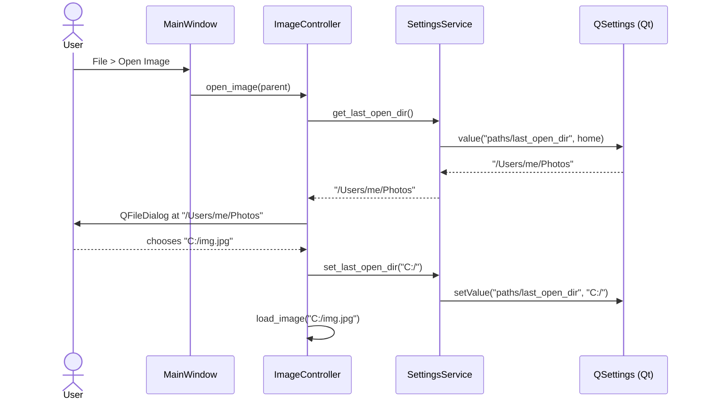

# 2026-05-03 -- App settings service and last-used paths

Slice owner: PhotoEdit team
Status: **DONE -- merged and smoked (2026-05-04)**
Related plan: [INCREMENTAL_WORKFLOW.md](../INCREMENTAL_WORKFLOW.md) sections 4, 5.1, 6 ; [PRODUCT_ROADMAP.md](../PRODUCT_ROADMAP.md) Phase B (app-level persistence bullet)

---

## 1. Problem and goal

**Problem.** PhotoEdit currently does **not** persist any user state between launches. Every `QFileDialog` opens at an empty default location ([`src/views/main_window.py:191`](../../../src/views/main_window.py), [`src/controllers/image_controller.py:114`](../../../src/controllers/image_controller.py), [`src/views/library_view.py:126`](../../../src/views/library_view.py)), so users are forced to navigate to their photo folder every time. Window size and dock layout are also reset on every launch. This was explicitly called out as a professional-app gap.

**Goal of this slice.** Introduce a small, well-tested `SettingsService` that wraps `QSettings`, then wire it into the **four file dialogs** plus **main window geometry** so:

- "Open Image" remembers the last directory.
- "Import Images" remembers the last directory (shared with Open).
- "Export Image" (Browse) remembers the last export directory.
- The main window restores its **size and position** on next launch.

**Non-goals (deferred to later slices, listed for clarity, will NOT be done in this slice):**

- Recent-files list (separate later slice).
- Theme switching / QSS resources (Phase B prefs UI).
- Window **state** beyond geometry (dock visibility, toolbar layout) -- can extend trivially later via `saveState/restoreState`, but **not** in this PR to keep the slice small.
- Per-image edit settings or any project file content (that is **K0**, separate slice).
- Preferences dialog UI; this slice is **headless settings only**.
- Migration from older settings (none exist).

---

## 2. Current behavior

| Concern | Current state | File |
|---------|---------------|------|
| Open Image dialog default dir | empty string `""` | [`image_controller.py:114-119`](../../../src/controllers/image_controller.py) |
| Import Images dialog default dir | empty string `""` | [`main_window.py:188-200`](../../../src/views/main_window.py), [`library_view.py:124-135`](../../../src/views/library_view.py) |
| Export Browse dialog default dir | uses current image path or empty | [`export_dialog.py:157-174`](../../../src/views/export_dialog.py) |
| Main window geometry | not saved/restored | [`main_window.py`](../../../src/views/main_window.py) (no save logic) |
| Application identity | `app.setApplicationName("PhotoEdit")` and `app.setOrganizationName("PhotoEdit")` already set | [`main.py:13-14`](../../../src/main.py) -- this is a **prereq for `QSettings`** and is already correct |

`QSettings` is not currently used anywhere in `src/`.

---

## 3. Proposed design

### 3.1 New module: `src/services/settings_service.py`

A thin, **typed** wrapper around `PyQt6.QtCore.QSettings` exposing exactly the keys we need now. All views and controllers use this service rather than calling `QSettings` directly (rule from INCREMENTAL_WORKFLOW.md section 5.1).

Public API (typed; unit-testable in isolation by passing a `QSettings` instance into the constructor):

```python
class SettingsService:
    def __init__(self, settings: Optional[QSettings] = None) -> None: ...

    # Last-used directories
    def get_last_open_dir(self) -> str: ...           # default: home dir
    def set_last_open_dir(self, path: str) -> None: ...

    def get_last_export_dir(self) -> str: ...         # default: home dir
    def set_last_export_dir(self, path: str) -> None: ...

    # Main window geometry (Qt's binary blob, base64 in QSettings)
    def get_window_geometry(self) -> Optional[bytes]: ...
    def set_window_geometry(self, geometry: bytes) -> None: ...

    # Generic helpers (kept private until needed)
    def _get(self, key: str, default: Any) -> Any: ...
    def _set(self, key: str, value: Any) -> None: ...

    # For tests / explicit flushing
    def sync(self) -> None: ...
```

All methods are tiny; logic lives in pure-Python helpers (validate path is a directory, return parent dir of file path when caller passes a file). Returning a **directory string only** keeps the API obvious.

### 3.2 Wiring (single instance lives on `MainWindow`)

`MainWindow.__init__` constructs **one** `SettingsService` and passes it to:

- `ImageController(image_view, settings_service=...)` -- new optional kwarg.
- `LibraryView(settings_service=...)` -- new optional kwarg with default `None` so existing tests still work.
- `ExportDialog(image, default_path, settings_service=..., parent=...)` -- new optional kwarg.

Each consumer:

1. On dialog open, ask `settings.get_last_open_dir()` (or last_export_dir for export).
2. After a successful selection, call `settings.set_last_open_dir(dirname_of_chosen_path)`.

For window geometry:

- `MainWindow.__init__` -- after `_setup_ui`, call `restoreGeometry(geometry)` if present.
- `MainWindow.closeEvent` -- before super, call `settings.set_window_geometry(self.saveGeometry())`.

### 3.3 Sequence (open image example)



---

## 4. API and data contracts

### 4.1 `QSettings` keys (versioned implicitly by name; **never rename**, only add)

| Key | Type | Default | Notes |
|------|------|---------|-------|
| `paths/last_open_dir` | str (path) | user home | Used by Open + Import dialogs. |
| `paths/last_export_dir` | str (path) | user home | Used by Export Browse dialog. |
| `window/geometry` | QByteArray | absent | `QMainWindow.saveGeometry()` blob. |

`QSettings` constructor: rely on `app.setOrganizationName("PhotoEdit")` and `app.setApplicationName("PhotoEdit")` already set in `main.py` -- no further config needed; defaults to native registry on Windows.

### 4.2 Backward compatibility

- All consumers accept `settings_service` as an **optional** kwarg. If `None`, behavior is identical to today (empty default dir, no geometry restore). This keeps existing tests untouched.

### 4.3 No JSON file or schema is introduced (that is K0).

---

## 5. Nuances and failure modes

1. **Stale path** -- saved dir was on a removable drive that is no longer mounted. Mitigation: when reading, if `os.path.isdir(stored)` is false, fall back to home directory **silently** (logged at `INFO`).
2. **First launch** -- no key present. `QSettings.value(key, default)` returns the supplied default; we feed `Path.home()`. Verified explicitly in tests.
3. **Cancelled dialogs** -- if user cancels, `QFileDialog` returns empty string. Do **not** write to settings on cancel. (Already the natural code path; unit test for it.)
4. **Path returned from `getOpenFileNames`** is a list -- store the parent of the **first** selected path (consistent with how Lightroom remembers a single import root).
5. **Export with no file chosen yet** -- `_path_edit.text()` may be empty; in that case use `settings.get_last_export_dir()` so users do not start at filesystem root.
6. **Cross-platform paths** -- always store as `str(Path(...))`. On Windows, `QSettings` stores in the registry under `HKCU\Software\PhotoEdit\PhotoEdit`; documented in `SettingsService` docstring.
7. **Headless tests** -- `QSettings` works without a running event loop. For unit tests we pass `QSettings(QSettings.Format.IniFormat, QSettings.Scope.UserScope, "PhotoEdit-Test", "Test")` pointed at a `tmp_path` to avoid polluting the real registry.
8. **Closing window** -- `QMainWindow.closeEvent` already exists; we add geometry save **before** the super call to avoid issues if the window is destroyed.
9. **Geometry on a disconnected monitor** -- Qt's `restoreGeometry` already clamps to visible screens in most cases. If the saved blob is corrupt or invalid, `restoreGeometry` returns `False` and we ignore (logged `WARNING`).
10. **Logging boundary** -- `SettingsService` uses `logging.getLogger(__name__)` per workflow section 7. No print statements.

---

## 6. UI and reskin impact

- **No widget changes** are introduced. No styling change.
- All edits stay in **controllers, services, and `MainWindow.closeEvent`** so future GUI reskins (per workflow section 5.1) remain unaffected.
- Views accept the service via constructor and only call it through the typed API; widgets do **not** import `QSettings` directly.

---

## 7. Dependencies

- **No new third-party packages.** `QSettings` is part of `PyQt6.QtCore`.
- **No effect on other phases:** This slice can land before or after **K0**. It does **not** define the project JSON schema. It will be reused by Phase B (export-with-previous, recent files) and indirectly by K (autosave path).

---

## 8. Test plan

### 8.1 New unit tests: `tests/unit/test_services/test_settings_service.py`

| Case | Assertion |
|------|-----------|
| Default `last_open_dir` on first launch | returns `str(Path.home())` |
| `set_last_open_dir` then `get_last_open_dir` round-trip | returns the same path |
| `set_last_open_dir` with a **file path** | stores the parent directory |
| `get_last_open_dir` when stored path no longer exists | falls back to home, logs at INFO |
| Same three cases for `last_export_dir` | mirrored |
| `set_window_geometry` then `get_window_geometry` round-trip | identical bytes |
| `get_window_geometry` when absent | returns `None` |
| `sync()` flushes without error | no exception |

Use a temporary `QSettings` (IniFormat, custom path) via a pytest fixture to isolate from the real registry.

### 8.2 Updates to existing tests

- [`tests/unit/test_controllers/test_image_controller.py`](../../../tests/unit/test_controllers/test_image_controller.py): pass an in-memory `SettingsService(QSettings(IniFormat,...))` where `ImageController` is constructed; verify `open_image` reads + writes `last_open_dir` (mock `QFileDialog.getOpenFileName` to return a known path).
- [`tests/unit/test_views/test_library_view.py`](../../../tests/unit/test_views/test_library_view.py): same pattern for `_import_images`.
- [`tests/ui/test_main_window.py`](../../../tests/ui/test_main_window.py): smoke test that creating + closing the window writes a `window/geometry` value.

### 8.3 Manual smoke checklist

1. Launch app: `pipenv run python -m src.main`. Window opens at default size.
2. Resize and move the window; close.
3. Relaunch -- window appears at the **same** size and position.
4. File > Open Image: dialog opens at home dir on first launch; choose a file in `Photos/`.
5. Cancel; reopen Open Image -- dialog now starts in `Photos/`.
6. File > Import Images: dialog also starts in `Photos/` (shared key).
7. File > Export...: Browse dialog starts in home; choose `Exports/` and save.
8. Reopen Export Browse -- starts in `Exports/`.
9. Manually delete the `Photos/` directory (or pick a non-existent stored path); reopen Open Image -- starts at home, status bar/log shows the fallback (INFO message).

---

## 9. Rollout and rollback

- **Rollout:** single PR; no migration; effect is invisible until user opens a dialog or relaunches.
- **Rollback:** the kwarg is optional; reverting the PR removes the wiring and the new module without touching unrelated logic. The persisted `QSettings` keys remain on disk but are unread; harmless.
- **Feature flag:** not required for this slice.
- **Logging:** `INFO` for path read/write and geometry restore; `WARNING` for invalid geometry blob; **no** full path is logged at higher than `INFO` to avoid privacy noise (see workflow section 7).

---

## 10. Acceptance criteria

All must be true before merge:

- [x] `SettingsService` exists in `src/services/settings_service.py` with the API in section 3.1.
- [x] All four `QFileDialog` callsites use the service for default directory and update it after a successful selection.
- [x] `MainWindow` saves geometry on close and restores on init when present.
- [x] All new unit tests in 8.1 pass (14/14).
- [x] Existing test suite still passes (`pipenv run pytest`) -- 225/225.
- [x] Manual smoke checklist (section 8.3) executed by project owner on Windows on 2026-05-04 -- all 9 steps pass.
- [x] No widget contains direct `QSettings` calls (grep clean -- only `SettingsService` itself imports `QSettings`).
- [x] No new dependency added to `Pipfile`.
- [x] Implementation note has a final **Implementation summary** subsection added in the same PR or immediate follow-up commit (per workflow section 4.3).

---

## 11. Approval

> **Plan approved -- implementation allowed**: yes
> Reviewer: project owner (chat approval)
> Date: 2026-05-03

When the user (or a reviewer) writes "approved" in chat or in this file, implementation can begin. Any scope change must edit this file first and re-approve.

---

## 12. Implementation summary (filled after merge)

**Status:** implemented, tested, and manually smoked (2026-05-04). Slice closed.

**Files added:**

- `src/services/settings_service.py` -- typed wrapper over `QSettings` for `paths/last_open_dir`, `paths/last_export_dir`, and `window/geometry`. Logs at INFO when stored paths are missing and the home fallback kicks in.
- `tests/unit/test_services/test_settings_service.py` -- 14 unit tests covering defaults, round-trips, file-vs-directory inputs, stale-path fallback (with `caplog`), key isolation, and geometry blob round-trip. Uses an isolated `QSettings(IniFormat)` fixture so tests do not touch the user's registry.

**Files modified:**

- `src/views/main_window.py`
  - Constructs (or accepts) a single `SettingsService` instance and threads it to `LibraryView` and `ImageController`.
  - `_import_images` now seeds the file dialog with the last-open dir and saves the chosen file's parent.
  - `_export_image` seeds `ExportDialog` with the last-export dir when no source path exists, and stores the chosen export directory after the dialog accepts.
  - New `_restore_window_geometry` (called from `__init__`) and `_save_window_geometry` (called from `closeEvent`).
- `src/controllers/image_controller.py` -- new optional `settings_service` constructor kwarg; `open_image` reads/writes `last_open_dir` when wired, and falls back to the legacy empty default when not.
- `src/views/library_view.py` -- new optional `settings_service` kwarg; `_import_images` reads/writes `last_open_dir` when wired.
- `src/views/export_dialog.py` -- new optional `settings_service` kwarg; `_browse_file` falls back to `last_export_dir` when the path edit is empty, and stores the chosen path's directory.
- `tests/unit/test_controllers/test_image_controller.py` -- adds `TestImageControllerOpenImageSettings` (3 cases) verifying dialog seeding, persistence, and the no-service backwards-compat path.
- `tests/unit/test_views/test_library_view.py` -- adds `TestLibraryViewImportSettings` (2 cases) mirroring the controller tests for `_import_images`.
- `tests/ui/test_main_window.py` -- adds `TestMainWindowSettingsPersistence` (2 cases) confirming `closeEvent` writes a non-empty geometry blob and that a second `MainWindow` instance restores the saved size.

**Test results:**

- New SettingsService unit tests: 14/14 pass.
- Wiring tests (controller + library + main window): 7/7 pass.
- Full suite (excluding `tests/performance`): **225 passed** (was 218 before this slice).
- Headless smoke: `MainWindow` constructs and closes cleanly with the default settings service.
- Manual smoke (Windows, 2026-05-04, project owner): all 9 steps in section 8.3 pass -- window restores size and position across launches; Open / Import / Export dialogs all start at the previously-used directories; deleting a stored directory falls back to home as expected.

**Decisions and notes:**

- `SettingsService` wraps `QSettings` rather than holding its own dict. This is the smallest API that keeps Views/Controllers ignorant of the persistence backend (no `QSettings` imports leaked outside the service).
- `set_last_open_dir(file_or_dir)` always normalizes to a directory by walking up to the parent when the path is a file; this means a missing path argument silently saves its existing parent (covered by tests).
- The controller and the two views accept the service as an optional kwarg; the legacy code paths still work when no service is supplied (covered by a regression test). This keeps the diff non-breaking for any callers that construct these classes directly.
- `closeEvent` flushes `QSettings` via `service.sync()` so geometry is durable even if the process is killed before exit handlers run.
- `_restore_window_geometry` defensively swallows exceptions so a corrupt blob cannot prevent the window from showing.

**Follow-ups (not in this slice):**

- Add a recent-files list and a "remember last theme" key (see `INCREMENTAL_WORKFLOW.md` section 6).
- Migrate dock-widget layout state to the same service when we touch the panel system.
- Add a GUI Preferences dialog once we have at least 2-3 user-visible toggles to expose.
